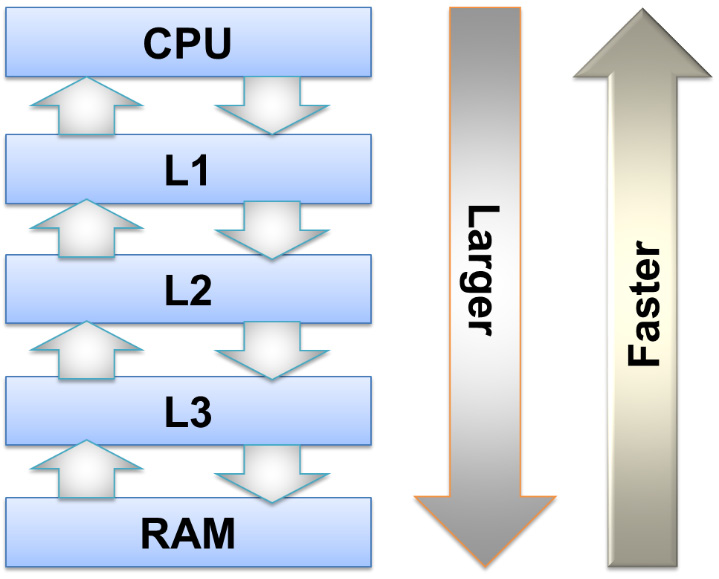

Chapter 4: Memory Architecture and Performance
========================================

Common CPU freq: 3 GHz
Common RAM freq: 400 MHz

But data rate != memory speed.
To convert, we need to account for Column Access Strobe Latency
(CAS Latency), which roughly means the roundtrip latency to process a
receive, retrieve, and return a read request.

For example, given:
* 3.2 GHz dat rate
* 15 cycle CAS latency
* = 107 MHz memory speed or 9.4 ns/read

The discrepancy between CPU and memory speed gets called "the memory gap."

The key trade-off between D(ynamic)RAM and S(tatic)RAM is speed for power
consumption. SRAM is faster but uses more power. The L1 cache is the
fastest, but its size is limited to a few KiB by its power usage.

Think in terms of cache sizes. Getting your data set to fit the L1/2/3 cache
greatly eliminates the memory gap as a bottleneck

Things to consider:
1. Does the data fit in a L# CPU cache?
2. What's your access pattern? Sequential or random?
3. What is the size of your atoms? E.g., i64 (8 bytes) vs. char (1-3 bytes)?

next|
> A simple benchmark for sequentially reading a large array can look like this:
